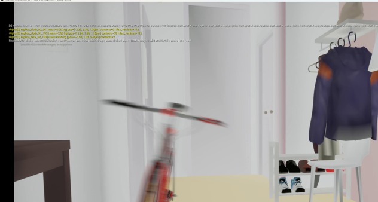

# Replica 영상 기록

[원본 MP4](https://github.com/YuSihyeon/ReplicaPhysicsTwin/raw/refs/heads/main/docs/research-archive/media/replica-demo-original.mp4) · [재생용 미리보기](media/replica-demo-preview.mp4) · [브라우저 영상 갤러리](https://YuSihyeon.github.io/ResearchArchive/gallery.html#replica) · [상세 연구 정리](README.ko.md)

원본 파일명: `replica_physics_demo_reverse_realtime.mp4`. 2560×1368, 14fps, 97frames, 약 6.93초. 원본 SHA-256: `add4bd444e1dde1b6b714fbec4872023343bb6f86e3acc67f04153881c6cb45c`.

자전거 이동과 의류 변형을 보여준다. 파일명에 reverse가 포함되어 있어 순방향 물리 시간이나 실시간 시뮬레이션 성능을 영상만으로 확정하지 않는다. 원본은 바이트 변경 없이 보존하고 미리보기만 H.264로 축소했다. ReplicaCAD 시각 자산: AI Habitat, CC BY 4.0. [공식 데이터와 라이선스](https://huggingface.co/datasets/ai-habitat/ReplicaCAD_dataset).
