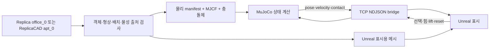

# ReplicaPhysicsTwin — 스캔 공간을 조작 가능한 물리 환경으로

원본 구현: [YuSihyeon/ReplicaPhysicsTwin](https://github.com/YuSihyeon/ReplicaPhysicsTwin). 정리 기준: 2026-09-16, 원본 코드 커밋 `d8912d5`와 로컬 생성 결과. **MuJoCo가 물리를 계산하고 Unreal Engine 5.7이 시각화·입력을 담당한다.** 이 연구는 Unity 프로젝트 또는 3DGS 학습 프로젝트와 별개의 구현이다.

[데모 영상과 해설](MEDIA.md) · [현재 생성 모델 요약](evidence/inspected-manifest-summary.json) · [이번 재검증 결과](evidence/reverified-physics-2026-09-16.json)

## 1. 의도와 연구 질문

원래 환경 보고서가 명시한 목표는 Replica `office_0`의 휴지곽 후보를 분리해, 중력·접촉·마찰·입력에 따라 움직이는 물체로 만드는 것이었다. 렌더러가 보기 좋은 움직임을 따로 생성하는 대신, MuJoCo의 상태를 화면에 그대로 전달해 물리 계산과 표현을 분리했다. 근거는 [초기 환경 보고서](evidence/ENVIRONMENT_REPORT.md), [물리 파이프라인 보고서](evidence/PHYSICAL_PIPELINE_REPORT.md)다.

자료를 종합하면 핵심 질문은 “촬영 또는 스캔한 공간에서 무엇을 움직일 수 있는 객체로 선별하고, 그 형상·질량·접촉을 어떤 근거로 시뮬레이션에 연결할 것인가?”이다. 이 문장은 코드·설계 기록을 바탕으로 정리한 연구 해석이며, 별도 인터뷰에서 확인한 개인적 동기로 제시하지 않는다.

## 2. 왜 이 도구와 데이터를 선택했는가

| 도구·자료 | 실제 역할 | 선정 근거와 한계 |
|---|---|---|
| Replica `office_0` | 공간 메시, semantic/instance 정보 | 실측 스캔 기반 공간에서 객체 분리·정렬을 시험. 원하는 물체가 semantic 목록에 없거나 의미가 모호함 |
| ReplicaCAD `apt_0` | 객체별 render GLB, collision GLB, 배치·질량 설정 | 시각 메시와 충돌 메시·물성 출처를 객체별로 연결하기 위해 후속 구현에서 채택 |
| Python / NumPy | PLY·GLB·JSON 처리, 좌표 변환, manifest/MJCF 생성 | 데이터 처리 규칙을 반복 가능한 코드로 보존 |
| MuJoCo | 강체, 접촉, 마찰, 천 flex 모델, 힘 입력 | 한 엔진에서 상태를 계산하고 UI와 분리 |
| Unreal Engine 5.7 / C++ | procedural mesh, 카메라, 선택·드래그 UI | 복원 공간을 실시간으로 탐색하고 물리 상태를 표시 |
| TCP + NDJSON | 명령·상태 전달 | JSON 메시지로 상태·단위·순서·오류를 명시하는 로컬 bridge |

ReplicaCAD는 Replica 스캔 공간을 아티스트가 재구성한 상호작용용 데이터셋이다. 따라서 `office_0` 스캔과 `apt_0` CAD 장면은 동일 입력의 버전 변경으로 취급하지 않는다. 객체별 충돌 기하와 물성 metadata는 [공식 데이터 설명](https://huggingface.co/datasets/ai-habitat/ReplicaCAD_dataset)에 명시되어 있다. 일반적인 엔진 기능은 [MuJoCo 공식 문서](https://mujoco.readthedocs.io/en/stable/overview.html)에서 확인할 수 있다.

## 3. 입력 → 처리 → 출력

ReplicaCAD 좌표 변환은 Y-up에서 Z-up으로 `[x,y,z] → [x,-z,y]`이고, 내부 물리 단위는 m, Unreal 표시는 cm다. `office_0`의 translation 정규화와는 별도 경로다. 기본 bridge는 `127.0.0.1:7007`, 상태 publication 설정은 60Hz다. **60Hz 설정이 실제 영상이나 전체 시스템에서 측정된 60 FPS 성능을 뜻하지는 않는다.**

상태에는 순번, simulation time, 위치·회전·속도·접촉·물성 출처를 전달한다. 오래된 순번과 잘못된 명령을 검사하고 재접속을 지원한다. Unreal에서 동적 객체의 Chaos physics는 비활성화해 이중 계산을 피한다. 초기 프로토콜은 [PROTOCOL.md](evidence/PROTOCOL.md), 최신 행동의 세부 구현은 [원본 bridge_server.py](https://github.com/YuSihyeon/ReplicaPhysicsTwin/blob/d8912d5/src/replica_physics_twin/bridge_server.py)를 따른다.

## 4. 진행 과정과 선별·제외 이유

| 단계 | 수행 내용 | 선택·수정 이유 및 확인 범위 |
|---|---|---|
| 데이터 준비 | `office_0` 19개 파일, 약 1.00GB 검사; 589,517 vertices, 588,759 polygon faces 확인 | 사각 polygon을 그대로 triangle로 해석하지 않도록 구분. 시각 변환 결과 1,177,518 triangles |
| 기본 물리 | 0.1kg 박스 낙하·접촉·0.1 N·s impulse | 복잡한 공간 전에 엔진·단위·힘 계산을 단순 모델로 확인 |
| bridge | MuJoCo 상태를 Unreal에 전송 | 통신·좌표·scale 문제와 물리 문제를 분리 |
| 정적 공간 | 바닥·벽·책상 충돌 proxy 생성 | 복잡한 시각 메시 전체를 하나의 볼록 충돌체로 사용하는 오류 방지 |
| 객체 분리 | `tissue-paper` ID 28을 `tissue_box`로 시험 | 데이터에 실제 존재하는 semantic 후보부터 제한적으로 시작 |
| 상호작용 | 휴지곽·정리함·의자 선택/힘 기반 drag | 객체 상태와 물성 출처를 함께 관찰 |
| ReplicaCAD 전환 | 자전거 1개 + 의류 2개, 나머지 110개는 정적 환경 | 원하는 이름을 primitive에 임의 부여하기보다 데이터셋에 실제 있는 객체와 충돌 geometry 사용 |
| 변형 물체 | 의류를 2D flex grid와 hanging-edge constraint로 구성 | 강체 옷 메시만 흔드는 대신 변형 자유도를 부여 |

제외 내역도 연구 과정의 일부다. `office_0`에는 책장에 해당하는 semantic instance가 없어 책장 후보를 제외했다. `undefined` 객체를 책장으로 잘못 승격한 자홍색 proxy를 제거했고, `wall_18`은 약 0.017 × 0.010 × 0.538m의 얇은 요소라 벽 충돌체에서 제외했다. 책상은 가구 전체 AABB 대신 상단의 근수평 면 band를 사용했다. 초기 reset이 30cm 들린 위치로 돌아가던 문제는 rest 위치와 lift 명령을 분리해 수정했다. 세부 근거: [충돌 보고서](evidence/PHASE5_COLLISION_REPORT.md), [동적 물체 보고서](evidence/PHASE6_TISSUE_BOX_REPORT.md), [실행 기록](evidence/RUN_LOG.md).

현재 `pipeline.yaml`에서는 object recognition과 Open3DIS를 끄고 dataset scene config를 사용한다. 따라서 현재 ReplicaCAD 결과를 새로운 영상 기반 자동 인식 또는 물성 추론 성과로 설명하지 않는다.

## 5. 결과: 과거 결과와 현재 파일을 분리

### 기본 박스 실험 — 저장된 과거 결과

| 항목 | 수치 | 의미 |
|---|---:|---|
| timestep | 0.002s | 기본 박스 테스트 설정 |
| 낙하 시작 중심 높이 | 0.35m | 반높이 0.05m 박스의 바닥 위 30cm 낙하 |
| 첫 접촉 | 약 0.25s | 중력 낙하 이후 접촉 |
| 최대 중심 침투 오차 | 4.22mm | 5mm 허용치를 만족한 이산 접촉 오차 |
| 최종 중심 높이 | 0.0499964m | 이상적 rest 중심 0.05m 근접 |
| impulse의 Δvx | 1.0m/s | J/m = 0.1/0.1과 일치 |

`solref` 시간상수를 0.02 → 0.01 → 0.005s로 바꿨을 때 보고된 침투량은 17.02 → 8.43 → 4.22mm다. 이는 이 단순 모델의 수치 응답 비교다. 실제 사물 물성이나 전체 방의 정확도를 검증한 값은 아니다. [보고서](evidence/PHYSICS_VALIDATION_REPORT.md), [저장 JSON](evidence/outputs/reports/phase2/phase2_summary.json).

### 현재 ReplicaCAD 생성 결과 — 이번에 파일 대조

| 항목 | 현재 manifest |
|---|---:|
| 선택 객체 | `bike_02`, `cloth_01`, `cloth_02` |
| 데이터셋 질량 | 9.0kg, 2.0kg, 0.6kg |
| 정적 객체 | 110개: convex decomposition 81개, bounding box 29개 |
| 모델 | bodies 337, geoms 150, joints 673, flexes 2 |
| 천 정점 | 각 8 × 14 = 112개, 합계 224개 |
| equality constraints | 17개 |
| 현재 MJCF timestep | 0.0005s |

질량은 source config를 복사한 값이고, inertia는 collision bounds에서 유도했다. Young's modulus(25,000/12,000Pa), 두께(0.002/0.001m), damping(0.06/0.04), drag coefficient(1.35)는 실측한 의류 특성으로 검증되지 않았다. manifest의 출처를 따라 **데이터셋 제공값 / 기하에서 유도한 값 / 실험용 가정값**을 구분해야 한다.

이전 [ReplicaCAD 구현 보고서](evidence/REPLICA_CAD_IMPLEMENTATION_REPORT.md)는 593 bodies / 117 geoms / 480 flex vertices / 25 constraints를 기술한다. 현재 생성 파일과 다르므로 위 표는 [현재 manifest 요약](evidence/inspected-manifest-summary.json)을 기준으로 썼다. 과거 기록은 변경하지 않고 비교 근거로 보존했다.

### 2026-09-16 재검증 — 통과하지 않은 항목

기존 `verify_replica_cad_physics.py`를 현재 로컬 생성 모델에 다시 적용했다. Python 3.13.10 / MuJoCo 3.10.0에서 모델 컴파일은 성공했지만, 전체 검증은 `body did not fall under gravity: replica_bike_02_100`로 중단됐다. 따라서 과거 보고서의 PASS를 현재 모델의 재검증 PASS로 복사하지 않았다. [실행 환경·오류 JSON](evidence/reverified-physics-2026-09-16.json).

현재 timestep에서 스크립트의 1,800 step은 0.9초다. 고정 step 수와 시간 기반 판정을 대조할 필요가 있으나, 이것만으로 실패 원인을 확정할 수 없다. 초기 pose·접촉·constraint와 엔진 버전도 함께 조사해야 한다. 이번 정리에서는 기존 물리 모델이나 검증 기준을 성공하도록 수정하지 않았다.

## 6. 영상은 무엇을 보여주는가

첨부 원본 `replica_physics_demo_reverse_realtime.mp4`는 2560 × 1368, 14 FPS, 97 frames, 약 6.93초다. 샘플 프레임에서 자전거의 이동과 의류 변형을 확인했다. 파일명에 `reverse`가 있어 순방향 물리 시간·충격량·실시간 실행 속도를 이 영상만으로 입증할 수 없다. 원본을 재편집하거나 재생 방향을 임의로 해석하지 않고 영상 목록에 해당 제한을 명시했다.

## 7. 결과 분석

확인된 성과는 데이터셋 객체·시각 형상·충돌체·질량 출처·엔진 상태·사용자 입력을 하나의 추적 가능한 파이프라인으로 연결한 것이다. 특히 보이는 메시와 계산용 충돌체를 구분하고 물리 계산 주체를 하나로 유지한 구조는, 향후 연구실 3DGS 장면에 물리 객체를 결합할 때 재사용할 수 있다.

실제 사물의 움직임을 재현한다는 주장은 아직 제한된다. `office_0`의 물성은 prior/override이고, ReplicaCAD 값도 이 연구실 사물의 측정치가 아니다. convex hull과 box가 오목 구조·얇은 면을 단순화하며, 천의 고정 경계·격자·탄성 계수는 실측 교정 전이다. 저장된 단순 낙하 테스트의 작은 오차가 전체 장면·재질·모든 상호작용의 정확도로 확장되지 않는다.

## 8. 재현과 보완 순서

원본 저장소에서 dataset 다운로드와 scene build를 수행한 뒤 bridge와 Unreal을 실행한다. 상세 명령은 [원본 README](https://github.com/YuSihyeon/ReplicaPhysicsTwin#reproduce-locally)에 있다. 소스 자산은 [ReplicaCAD 공식 배포](https://huggingface.co/datasets/ai-habitat/ReplicaCAD_dataset)를 사용하고 대용량 원본·Unreal cache는 이 archive에 중복 업로드하지 않는다.

1. **버전 고정과 실패 재현:** Python/MuJoCo 버전, commit, XML·manifest hash, timestep·검증 시간을 묶어 baseline을 확정한다. 현재 자전거 검증 실패를 먼저 분리한다.
2. **물성 교정:** 실제 질량, 경사면의 미끄럼 시작 각도, 낙하 후 반발, 천 처짐과 진동을 측정하고 가정값 범위와 함께 기록한다.
3. **충돌체 비교:** AABB, convex decomposition, 개선 메시를 동일 장면에서 비교하고 침투·정착·성능을 함께 측정한다.
4. **bridge 성능:** 송신·수신 timestamp로 latency와 jitter, 명령 ACK, stale frame 비율을 계측한다.
5. **GS 연계:** GS는 외관을 담당하고 검증된 물리 geometry와 object transform을 공유하도록 연결한다. GS appearance가 정확한 질량·마찰을 제공한다고 가정하지 않는다.
6. **결과 자동 생성:** build 결과에서 표와 README 수치를 자동 갱신해 480/224 정점처럼 문서와 실물이 어긋나는 일을 줄인다.

## 근거 보관 방식

`evidence/`는 기존 보고서·설정·경량 결과의 사본과 이번 audit이다. 과거 보고서의 승인 대기·단계 지시는 당시 기록이며 현재 작업 지시가 아니다. 일부 역사 문서의 상대경로는 원본 프로젝트용이므로, 이 정리의 본문 링크와 원본 저장소를 기준으로 탐색한다. 사본에서는 컴퓨터 절대 경로를 placeholder로 바꿨고 원본 대응·hash는 로컬 `source-map.json`에 보존했다. ReplicaCAD 파생 시각 결과의 원자료는 AI Habitat, CC BY 4.0이며 저작권과 라이선스는 원자료를 따른다.
