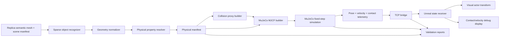

# Physical Object Twin Pipeline Implementation Plan

> **For agentic workers:** REQUIRED SUB-SKILL: Use superpowers:executing-plans to implement this plan task-by-task after user approval. Each task ends with an automated verification gate and a user-visible evidence gate where applicable.

**Goal:** Replica `office_0`의 시각·의미 데이터를 물체 속성, 충돌체, MuJoCo 동역학, 접촉 telemetry, Unreal 표시까지 연결하여 물체가 환경의 물리 법칙에 따라 움직이는 재현 가능한 파이프라인을 만든다.

**Architecture:** Replica 원본은 읽기 전용으로 유지하고, 파생 physical manifest를 먼저 생성한다. MuJoCo는 mass, inertia, gravity, contact, friction, external force를 계산하는 유일한 물리 권위이며, Unreal은 MuJoCo가 보낸 pose와 물리 상태를 시각화하고 접촉 정보를 표시한다. 시각 메시와 MuJoCo collision proxy는 분리하고, 모든 추정 물성에는 출처·신뢰도·override 여부를 기록한다.

**Tech Stack:** Python 3.11, `mujoco==3.10.0`, NumPy, JSON/YAML manifests, newline-delimited JSON TCP bridge, Unreal Engine 5.7 C++.

## Global Constraints

- `C:\URLabWorkspace\RobotLLM`은 읽기 전용이며 변경하지 않는다.
- `C:\URLabWorkspace\ReplicaPhysicsTwin\data\raw\replica_v1\office_0`은 읽기 전용이며 원본 파일을 덮어쓰지 않는다.
- MuJoCo만 물리 상태의 권위 있는 출처로 사용한다.
- Unreal 동적 액터는 Chaos Physics를 사용하지 않고 MuJoCo pose를 표시한다.
- MuJoCo 내부 단위는 meter, Unreal 내부 표시 단위는 centimeter, up axis는 Z로 고정한다.
- 시각 메시와 물리 collision proxy를 분리한다.
- 의미 ID가 `undefined`인 객체는 자동으로 물리 객체로 승격하지 않는다.
- 질량·마찰·반발 등 실측되지 않은 값은 추정값으로 표시하며 실제 측정값처럼 보고하지 않는다.
- Open3DIS 및 별도 자동 3D 분리 파이프라인은 이 계획에 포함하지 않는다.
- 현재 첫 MVP는 `tissue_box`의 lift/drop, 환경 충돌, 정지, reset 재현성에 집중한다.

## 쉽게 말하면

전체 작업은 다음 다섯 질문에 답하는 과정이다.

1. **어떤 물체인가?**
   - 우선 사진이나 대형 AI 모델을 쓰지 않고, Replica가 가진 object ID, semantic label, 크기, 위치, face count, 주변 책상과의 관계만 사용한다.
2. **크기와 물성이 무엇인가?**
   - 메시에서 크기와 형상을 재고, 질량·마찰은 실측값·사용자 입력·재질 추정값을 구분한다.
3. **어디에 부딪힐 수 있는가?**
   - 바닥·벽·책상·물체를 MuJoCo용 단순 collision proxy로 만든다.
4. **실제로 어떻게 움직이는가?**
   - MuJoCo가 중력, 충돌, 마찰, 접촉력을 계산한다. Unreal은 계산하지 않는다.
5. **Unreal에서 무엇을 보여줄 것인가?**
   - MuJoCo가 계산한 위치, 회전, 속도, 접촉 대상, 접촉력을 그대로 보여준다.

첫 인식 실험의 범위는 작게 고정한다.

- 입력: `scene_manifest.json`, `semantic_summary.json`, semantic mesh의 object ID·bounds·face count·위치
- 사용하지 않음: RGB 이미지, texture, Open3DIS, 대형 vision-language model
- 목표: `tissue_box` 후보를 찾고 `selected / ambiguous / not_present`로 판정
- 결과: 후보별 점수와 근거를 기록하고, confidence가 낮으면 자동으로 물리 객체로 만들지 않음

## 설계 개요



인식 결과가 `tissue_box`로 확정되어야만 다음 단계에서 MuJoCo dynamic body를 만든다. 인식 결과가 애매하면 후보 목록만 만들고 사용자 확인에서 멈춘다.

## 사용자가 실제로 쓰는 최종 흐름

사용자 관점에서는 다음처럼 동작해야 한다.

```text
화면에서 물체 클릭
→ 여러 물체를 선택 목록에 추가
→ 선택된 물체의 크기·질량·마찰·충돌체 정보를 확인
→ 선택 물체를 잡고 이동
→ Unreal이 직접 위치를 확정하지 않고 MuJoCo에 목표 위치만 전달
→ MuJoCo가 잡아당기는 힘, 중력, 충돌, 마찰을 계산
→ 선택 물체끼리와 환경 collision proxy가 서로 영향을 줌
→ MuJoCo의 결과 pose·속도·접촉 정보를 Unreal에 표시
```

여기서 가장 중요한 점은 **마우스로 물체를 움직일 때도 Unreal이 물체 Transform을 직접 써버리지 않는 것**이다. Unreal은 손 또는 마우스의 목표 위치만 보내고, MuJoCo가 constraint를 통해 물체에 힘을 가한다. 그래서 책상에 막히거나, 다른 선택 물체를 밀거나, 마찰 때문에 늦게 움직이는 결과가 실제 물리 계산으로 나온다.

첫 번째 사용자 실험에서는 다음 범위로 제한한다.

- `Ctrl` 또는 `Shift` 클릭으로 여러 물체를 선택한다.
- 선택 목록과 물성 패널에는 현재 sparse manifest에 등록된 정보만 표시한다.
- 선택한 여러 물체를 하나의 그룹으로 잡으면 각 물체의 상대 위치를 보존한 채 MuJoCo constraint를 각각 만든다.
- 물체를 놓으면 constraint를 제거하고, 이후에는 중력·충돌·마찰만 남긴다.
- 합쳐진 방 메시 전체를 직접 raycast하지 않고, 우선 선택 가능한 물체만 별도 semantic visual actor로 표시하여 object ID를 정확히 얻는다.

## 양방향 물리 상호작용

선택 물체와 환경의 관계를 두 종류로 나눈다.

| 환경 종류 | MuJoCo 표현 | 선택 물체가 할 수 있는 일 |
|---|---|---|
| 바닥·벽·책상 같은 고정 구조 | static collision geom | 부딪히고, 멈추고, 미끄러지고, 반발할 수 있음. 구조물 자체는 움직이지 않음 |
| 책·컵·PC처럼 움직일 수 있는 물체 | `freejoint` dynamic body | 밀기, 넘어뜨리기, 충돌시키기, 서로 튕기기 가능 |

따라서 “선택한 물체가 환경에 작용한다”는 요구를 충족하려면 다음이 필요하다.

1. 선택 물체를 MuJoCo dynamic body로 만든다.
2. 책상·벽에는 접촉 반력을 적용한다.
3. 밀려야 하는 환경 물체도 mass, inertia, friction이 있는 dynamic body로 만든다.
4. 사용자가 잡고 움직일 때는 MuJoCo constraint가 선택 물체에 힘을 가한다.
5. 선택 물체가 다른 dynamic body에 닿으면 상대 물체의 속도와 회전도 MuJoCo가 계산한다.
6. Unreal은 두 물체의 결과 pose를 모두 받아 표시한다.

Unreal에서 선택 물체의 위치를 직접 바꾸면 환경에 힘이 전달되지 않으므로 금지한다. `grab_update`는 목표 위치만 전달하고, 실제 작용·반작용은 MuJoCo contact solver가 계산한다.

첫 양방향 실험은 다음 세 가지로 검증한다.

- 선택 물체를 책상에 밀어 넣기: 물체가 책상 안으로 통과하지 않고 반력으로 멈춤
- 선택 물체를 다른 dynamic 물체에 밀기: 상대 물체가 움직이거나 회전함
- 물체를 놓기: constraint가 제거된 뒤 두 물체가 중력·마찰·충돌에 따라 계속 움직임

## 물체 물성 및 상태 계약

물체마다 다음 physical manifest 레코드를 만든다.

```json
{
  "object_id": "tissue_box",
  "source_object_id": 28,
  "class_name": "tissue-paper",
  "body_type": "freejoint",
  "geometry": {
    "source_bounds_m": {"min": [-0.3703, -0.9610, -0.5491], "max": [-0.2002, -0.8101, -0.3369]},
    "size_m": [0.1702, 0.1509, 0.2123],
    "collision_shape": "box",
    "collision_half_size_m": [0.0851, 0.0754, 0.1061]
  },
  "dynamics": {
    "mass_kg": 0.25,
    "inertia_diagonal_kg_m2": [0.0017, 0.0010, 0.0011],
    "friction": [0.8, 0.1, 0.1],
    "contact_solref": [0.005, 1.0],
    "contact_solimp": [0.9, 0.95, 0.001]
  },
  "provenance": {
    "mass": {"source": "mvp_estimate", "confidence": "low", "requires_measurement": true},
    "size": {"source": "semantic_mesh_measurement", "confidence": "high", "requires_measurement": false},
    "friction": {"source": "material_prior", "confidence": "medium", "requires_measurement": true}
  },
  "initial_pose": {
    "position_m": [-0.4796, -0.2368, 0.7711],
    "quaternion_wxyz": [1.0, 0.0, 0.0, 0.0],
    "support_proxy": "desk_58"
  }
}
```

MuJoCo state v2는 기존 pose/velocity 외에 접촉을 명시한다.

```json
{
  "type": "state",
  "schema_version": 2,
  "seq": 123,
  "sim_time": 0.246,
  "units": "meter",
  "up_axis": "Z",
  "objects": [{
    "id": "tissue_box",
    "position_m": [-0.4796, -0.2368, 0.7669],
    "quaternion_wxyz": [1.0, 0.00002, 0.0, 0.0],
    "linear_velocity_mps": [0.0, -0.0005, -0.05],
    "angular_velocity_rps": [0.004, 0.0, 0.0],
    "contacts": [{
      "geom": "desk_58",
      "normal_force_n": 1.9,
      "position_m": [-0.48, -0.24, 0.66]
    }],
    "is_sleeping": false
  }]
}
```

`contacts`는 장면 표시와 검증을 위한 MuJoCo 측 결과이며, Unreal에서 새 충돌을 계산하거나 보정하지 않는다.

## Task 0: 적은 정보 기반 object recognition 실험

**Files:**
- Create: `src/replica_physics_twin/object_recognition.py`
- Create: `scripts/recognize_office0_objects.py`
- Create: `tests/test_object_recognition.py`
- Create: `outputs/metadata/office0_object_candidates.json`
- Create: `outputs/reports/object_recognition_experiment.json`

**Interfaces:**
- `extract_sparse_object_features(scene_manifest: dict, semantic_summary: dict, semantic_mesh_path: Path) -> list[dict]`
- `rank_object_candidates(features: list[dict], target: str, aliases: dict, target_priors: dict) -> list[dict]`
- `recognize_object(features: list[dict], target: str, aliases: dict, target_priors: dict, min_confidence: float = 0.75) -> dict`

인식 점수는 다음 순서로 계산한다.

1. semantic class 또는 alias가 목표와 정확히 일치하면 가장 높은 점수
2. object bounds가 목표 물체의 허용 크기 범위에 들어오는지 확인
3. 책상·바닥 등 support proxy와의 공간 관계를 확인
4. face count와 geometry 복잡도를 보조 특징으로 사용
5. 증거가 부족하면 `ambiguous`를 반환하고 물리 객체를 생성하지 않음

`tissue_box`의 첫 실험은 object ID 28을 정답으로 하드코딩하는 것이 아니라, 후보 목록 안에 ID 28이 왜 선택되었는지 근거를 기록하는 방식으로 만든다. 정답 비교용 expected label은 테스트에만 사용한다.

- [ ] semantic label, bounds, support 관계만으로 tissue-box 후보를 ranking하는 failing test를 먼저 작성한다.
- [ ] RGB·texture·외부 모델 없이도 후보별 `score`, `evidence`, `confidence`, `status`가 생성되도록 한다.
- [ ] 동일 점수 후보가 둘 이상이면 `ambiguous`가 되고 `requires_user_confirmation: true`가 되도록 한다.
- [ ] 후보가 없으면 `not_present`가 되고 downstream physical manifest 생성이 중단되도록 한다.
- [ ] 실행 명령: `python scripts/recognize_office0_objects.py --target tissue_box`; 기대 결과는 object 28 후보, 근거 목록, confidence, 판정 상태가 JSON에 기록되는 것이다.
- [ ] 실행 명령: `pytest -q tests/test_object_recognition.py`; 기대 결과는 exact match, ambiguous, not-present 테스트 PASS다.

## Task 1: Physical property resolver와 manifest 계약

**Files:**
- Create: `src/replica_physics_twin/physical_properties.py`
- Create: `configs/physical_overrides.yaml`
- Create: `tests/test_physical_properties.py`
- Modify: `configs/material_priors.yaml` only to add explicit provenance fields for paper, wood, metal, plastic, and unknown surfaces.

**Interfaces:**
- `resolve_object_properties(object_record: dict, geometry: dict, material_priors: dict, overrides: dict | None) -> dict`
- `compute_box_inertia_diagonal(mass_kg: float, size_m: list[float]) -> list[float]`
- `build_physical_manifest(scene_manifest: dict, geometry_records: dict, material_priors: dict, overrides: dict) -> dict`

- [ ] `tissue_box`의 semantic size, mass override 우선순위, friction, contact parameters를 검증하는 failing test를 먼저 작성한다.
- [ ] override 우선순위를 `measured_override > user_override > material_prior > mvp_estimate`로 고정하고 각 결과에 `source`, `confidence`, `requires_measurement`를 넣는다.
- [ ] 물리 객체가 아닌 fixed environment proxy에는 질량 계산을 적용하지 않고 `body_type: fixed`로 기록한다.
- [ ] `undefined` semantic object가 자동으로 동적 물체가 되면 테스트가 실패하도록 한다.
- [ ] 실행 명령: `pytest -q tests/test_physical_properties.py`; 기대 결과는 모든 resolver 테스트 PASS다.

## Task 2: 자동 geometry 정규화와 collision proxy 생성

**Files:**
- Create: `src/replica_physics_twin/physical_scene.py`
- Create: `scripts/build_office0_physical_scene.py`
- Create: `tests/test_physical_scene.py`
- Modify: `src/replica_physics_twin/office0_collision.py` to consume the physical manifest while preserving the existing Phase 5 output format.

**Interfaces:**
- `build_environment_proxies(scene_manifest: dict, semantic_mesh_path: Path) -> list[dict]`
- `build_dynamic_collision_proxy(physical_object: dict) -> dict`
- `validate_initial_pose_against_support(body: dict, proxies: list[dict]) -> dict`
- `render_physical_mjcf(manifest: dict) -> str`

- [ ] 동일한 `object_id`에 대해 semantic source bounds, normalized visual bounds, collision bounds가 각각 기록되는 failing test를 작성한다.
- [ ] fixed environment collision은 floor, walls, desks를 생성하고, 실제 semantic 후보가 없는 bookcase는 생성하지 않는다.
- [ ] 움직일 수 있는 환경 물체 후보는 `body_type: freejoint`로 만들며, mass·inertia·friction·initial pose가 없으면 dynamic body로 승격하지 않는다.
- [ ] dynamic object collision은 tissue box의 측정된 size를 box geom으로 사용하고, 초기 pose에서 support top과 box bottom이 일치하는지 검사한다.
- [ ] 초기 penetration, 바닥 아래 생성, 지원 프록시 외부 생성은 artifact 생성을 실패시킨다.
- [ ] 산출물은 다음으로 고정한다.
  - `outputs/metadata/office0_physical_manifest.json`
  - `outputs/mjcf/office0_physical_scene.xml`
  - `outputs/reports/physical_scene_build.json`
- [ ] 실행 명령: `python scripts/build_office0_physical_scene.py`; 기대 결과는 MJCF compile PASS와 proxy alignment PASS다.

## Task 3: MuJoCo 물리 실행기와 접촉 telemetry

**Files:**
- Create: `src/replica_physics_twin/contact_telemetry.py`
- Modify: `src/replica_physics_twin/bridge_server.py`
- Modify: `src/replica_physics_twin/bridge_protocol.py`
- Create: `tests/test_contact_telemetry.py`
- Modify: `tests/test_bridge_protocol.py`

**Interfaces:**
- `collect_body_contacts(model: mujoco.MjModel, data: mujoco.MjData, body_id: int) -> list[dict]`
- `build_object_state(model: mujoco.MjModel, data: mujoco.MjData, body_name: str) -> dict`
- `MuJoCoBridgeServer._step_once() -> None` remains the only simulation integration point.

- [ ] 테스트가 lift/drop 이후 `contacts`에 `desk_58`이 포함되고 접촉 직전 하강 속도가 접촉 후 반전되는 것을 먼저 표현한다.
- [ ] `mujoco.mj_contactForce`로 contact normal force를 계산하고, Unreal에서 재계산하지 않도록 state message에 넣는다.
- [ ] bridge loop는 고정 timestep `model.opt.timestep`으로만 `mj_step`을 호출한다.
- [ ] `lift_drop`은 외부 조작으로 pose를 들어 올리는 한 번의 명령으로 제한하고, 그 이후에는 qpos를 보정하지 않는다.
- [ ] `reset`은 동일한 keyframe을 사용하고, reset 후 첫 state의 pose가 physical manifest의 initial pose와 tolerance 안에서 일치해야 한다.
- [ ] schema v2를 추가하되 기존 schema v1 state를 읽을 수 있는 compatibility path를 유지한다.
- [ ] 실행 명령: `pytest -q tests/test_contact_telemetry.py tests/test_bridge_protocol.py tests/test_tissue_box.py`; 기대 결과는 접촉·속도·reset 테스트 PASS다.

## Task 4: MuJoCo → Unreal 상태 및 물리 증거 표시

**Files:**
- Create: `unreal/Source/ReplicaPhysicsTwin/Public/Bridge/MuJoCoPhysicsTelemetryComponent.h`
- Create: `unreal/Source/ReplicaPhysicsTwin/Private/Bridge/MuJoCoPhysicsTelemetryComponent.cpp`
- Modify: `unreal/Source/ReplicaPhysicsTwin/Public/Bridge/MuJoCoBridgeTypes.h`
- Modify: `unreal/Source/ReplicaPhysicsTwin/Private/Bridge/MuJoCoBridgeTypes.cpp`
- Modify: `unreal/Source/ReplicaPhysicsTwin/Public/Bridge/MuJoCoStateReceiverComponent.h`
- Modify: `unreal/Source/ReplicaPhysicsTwin/Private/Bridge/MuJoCoStateReceiverComponent.cpp`
- Modify: `unreal/Source/ReplicaPhysicsTwin/Public/Bridge/MuJoCoBridgeDemoActor.h`
- Modify: `unreal/Source/ReplicaPhysicsTwin/Private/Bridge/MuJoCoBridgeDemoActor.cpp`
- Modify: `unreal/Source/ReplicaPhysicsTwin/Private/Bridge/MuJoCoBridgeDemoGameMode.cpp`

**Interfaces:**
- `FMuJoCoObjectState::Contacts` stores parsed contact records without changing transform authority.
- `UMuJoCoStateReceiverComponent::ApplyState` applies only `Object.ToUnrealTransform()` and forwards telemetry to the owner.
- `UMuJoCoPhysicsTelemetryComponent::UpdateTelemetry(const FMuJoCoObjectState& State) -> void` updates world-space debug text and contact markers.

- [ ] Unreal parser test/automation test가 schema v2 state의 contacts, velocities, and sleep flag를 읽도록 먼저 작성한다.
- [ ] tissue actor가 semantic visual mesh를 표시하고 collision은 `NoCollision`으로 유지한다.
- [ ] object ID registry를 사용하여 `T`와 `R`이 임의의 첫 actor가 아니라 `tissue_box` actor에만 명령을 보내도록 한다.
- [ ] object 위에 다음 정보를 표시한다: `object_id`, `source=MuJoCo`, `v`, `omega`, `contact geom`, `normal force`, `sleeping`.
- [ ] contact marker는 MuJoCo가 보낸 contact position에만 그리며, Unreal collision query 결과를 사용하지 않는다.
- [ ] fixed collision debug boxes는 physical manifest에서 읽어 MuJoCo XML과 같은 데이터로 그린다.
- [ ] 실행 명령: Unreal Editor Development build; 기대 결과는 compile PASS, `Connected ... object tissue_box`, `contact=desk_58` 표시다.

## Task 5: 속성값이 실제 행동에 반영되는 자동 검증

**Files:**
- Create: `tests/test_physical_pipeline.py`
- Create: `scripts/verify_physical_pipeline.py`
- Modify: `PHASE6_TISSUE_BOX_REPORT.md`
- Create: `PHYSICAL_PIPELINE_REPORT.md`

**Interfaces:**
- `run_physical_pipeline_verification(project_root: Path) -> dict`
- Report sections: `property_provenance`, `scene_alignment`, `contact_response`, `reset_reproducibility`, `bridge_mapping`, `unreal_evidence`.

- [ ] 다음 deterministic scenario를 자동화한다.
  1. physical manifest load
  2. MuJoCo XML compile
  3. reset
  4. tissue box lift by 0.30m
  5. gravity-only descent
  6. contact with the declared support proxy
  7. post-contact velocity/rotation response
  8. settled pose and no penetration
  9. reset and repeat with the same result tolerance
- [ ] friction property를 낮춘 variant와 기본 variant를 비교하여 horizontal impulse 후 속도 감쇠가 달라지는지 검증한다. 이 비교는 물성값이 MJCF에 실제로 전달되는지를 검사한다.
- [ ] mass/inertia/friction 값이 모두 provenance를 가지지 않으면 report는 PASS가 아니라 `NEEDS_MEASUREMENT`로 표시한다.
- [ ] state stream에 object ID mismatch, rejected command, NaN, stale sequence가 있으면 report를 실패시킨다.
- [ ] 실행 명령: `python scripts/verify_physical_pipeline.py`; 기대 결과는 `contact_response.passed=true`, `reset_reproducibility.passed=true`, `unreal_evidence.status=NEEDS_USER_VERIFICATION` 또는 사용자 확인 후 `PASS`다.

## Task 6: Unreal 물체 선택과 다중 선택 목록

**Files:**
- Create: `unreal/Source/ReplicaPhysicsTwin/Public/Bridge/ReplicaObjectSelectionComponent.h`
- Create: `unreal/Source/ReplicaPhysicsTwin/Private/Bridge/ReplicaObjectSelectionComponent.cpp`
- Create: `unreal/Source/ReplicaPhysicsTwin/Public/Bridge/ReplicaPhysicsHUD.h`
- Create: `unreal/Source/ReplicaPhysicsTwin/Private/Bridge/ReplicaPhysicsHUD.cpp`
- Modify: `unreal/Source/ReplicaPhysicsTwin/Public/Bridge/MuJoCoBridgeDemoActor.h`
- Modify: `unreal/Source/ReplicaPhysicsTwin/Private/Bridge/MuJoCoBridgeDemoActor.cpp`
- Modify: `unreal/Source/ReplicaPhysicsTwin/Public/Bridge/MuJoCoBridgeDemoPlayerController.h`
- Modify: `unreal/Source/ReplicaPhysicsTwin/Private/Bridge/MuJoCoBridgeDemoPlayerController.cpp`
- Modify: `unreal/Source/ReplicaPhysicsTwin/Private/Bridge/MuJoCoBridgeDemoGameMode.cpp`

**Interfaces:**
- `UReplicaObjectSelectionComponent::SetSelected(bool bSelected) -> void`
- `UReplicaObjectSelectionComponent::GetObjectId() -> FString`
- `AMuJoCoBridgeDemoPlayerController::GetSelectedObjectIds() -> TArray<FString>`
- `AMuJoCoBridgeDemoPlayerController::HandleObjectClick(bool bToggleSelection) -> void`

- [ ] semantic visual actor를 hit-test 가능한 selectable actor로 등록하는 failing automation test를 먼저 작성한다.
- [ ] 단일 클릭은 선택을 교체하고, `Ctrl/Shift` 클릭은 기존 선택을 유지하면서 선택을 추가·해제하도록 한다.
- [ ] 선택된 여러 actor에 object ID와 선택 강조 표시를 적용한다.
- [ ] 현재 합쳐진 static room mesh는 직접 object ID를 반환하지 않으므로, 첫 실험에서는 manifest에 등록된 selectable object만 별도 visual actor로 생성한다.
- [ ] selection set은 visual actor의 Transform을 직접 변경하지 않고 이후 grab 명령의 입력으로만 사용한다.
- [ ] 실행 결과: 화면에 선택된 object ID 목록이 표시되고, 선택 수가 0개·1개·여러 개인 경우가 모두 구분된다.

## Task 7: 선택 물체의 크기·속성 확인 패널

**Files:**
- Modify: `unreal/Source/ReplicaPhysicsTwin/Public/Bridge/ReplicaPhysicsHUD.h`
- Modify: `unreal/Source/ReplicaPhysicsTwin/Private/Bridge/ReplicaPhysicsHUD.cpp`
- Create: `src/replica_physics_twin/physical_manifest.py`
- Create: `tests/test_physical_manifest.py`
- Modify: `unreal/Source/ReplicaPhysicsTwin/Private/Bridge/MuJoCoBridgeDemoGameMode.cpp`

**Interfaces:**
- `load_physical_manifest(path: Path) -> dict`
- `get_object_property_view(manifest: dict, object_ids: list[str]) -> list[dict]`
- HUD view fields: `object_id`, `class_name`, `size_cm`, `mass_kg`, `friction`, `collision_shape`, `property_source`, `confidence`.

- [ ] manifest에서 선택 object ID의 속성만 읽어 property view를 만드는 failing test를 먼저 작성한다.
- [ ] 선택 물체의 크기, 질량, 관성, 마찰, collision shape, 물성 출처, confidence를 화면에 표시한다.
- [ ] estimated 값에는 `ESTIMATED`를 표시하고, measured 값과 같은 색상·문구로 표시하지 않는다.
- [ ] 여러 물체 선택 시 각 물체의 속성을 행 단위로 표시하고, 서로 다른 속성을 평균내어 하나의 값으로 합치지 않는다.
- [ ] 실행 결과: 사용자가 물체를 선택했을 때 물성 패널이 나타나고, 선택을 해제하면 패널이 비워진다.

## Task 8: MuJoCo constraint 기반 다중 물체 이동

**Files:**
- Modify: `src/replica_physics_twin/bridge_protocol.py`
- Modify: `src/replica_physics_twin/bridge_server.py`
- Modify: `unreal/Source/ReplicaPhysicsTwin/Public/Bridge/MuJoCoStateReceiverComponent.h`
- Modify: `unreal/Source/ReplicaPhysicsTwin/Private/Bridge/MuJoCoStateReceiverComponent.cpp`
- Modify: `unreal/Source/ReplicaPhysicsTwin/Private/Bridge/MuJoCoBridgeDemoPlayerController.cpp`
- Create: `tests/test_grab_constraints.py`
- Modify: `tests/test_bridge_protocol.py`

**Interfaces:**
- `send_grab_begin(grabs: list[dict]) -> bool`
- `send_grab_update(grabs: list[dict]) -> bool`
- `send_grab_end(object_ids: list[str]) -> bool`
- `MuJoCoBridgeServer._begin_grabs(message) -> None`
- `MuJoCoBridgeServer._update_grabs(message) -> None`
- `MuJoCoBridgeServer._end_grabs(message) -> None`

Command payloads are explicit and contain no Unreal-only pose authority.

```json
{
  "type": "command",
  "schema_version": 2,
  "command": "grab_update",
  "grabs": [{
    "object_id": "tissue_box",
    "target_position_m": [-0.45, -0.20, 0.95],
    "target_quaternion_wxyz": [1.0, 0.0, 0.0, 0.0]
  }]
}
```

- [ ] command validation 테스트를 먼저 작성하여 빈 object ID, 미등록 object, non-finite pose, grab 종료 누락을 검증한다.
- [ ] `grab_begin`은 각 freejoint object에 대한 MuJoCo mocap/constraint target을 활성화한다.
- [ ] `grab_update`은 qpos를 직접 쓰지 않고 mocap target만 갱신한다. 실제 object pose 변화는 MuJoCo constraint force와 `mj_step`의 결과여야 한다.
- [ ] 여러 선택 물체를 잡으면 anchor 기준 상대 pose를 유지하는 target을 각 물체에 보낸다.
- [ ] `grab_end`는 constraint를 제거하고, 이후에는 중력·충돌·마찰만 적용한다.
- [ ] 선택 물체끼리 충돌할 수 있고, desk/wall/floor proxy와 충돌할 수 있어야 한다.
- [ ] 두 번째 dynamic body를 선택 물체가 밀었을 때 상대 body의 linear/angular velocity가 0에서 변하는 integration test를 추가한다.
- [ ] static desk 접촉에서는 선택 물체가 반력으로 멈추고, dynamic body 접촉에서는 두 body의 상태가 모두 바뀌는 것을 구분해 검증한다.
- [ ] 테스트에서 물체가 target을 즉시 teleport하지 않고 유한한 속도로 따라가며, 장애물 접촉 시 contact telemetry가 생성되는지 확인한다.
- [ ] 실행 명령: `pytest -q tests/test_grab_constraints.py tests/test_bridge_protocol.py`; 기대 결과는 constraint 이동, contact, release 후 자유 운동 테스트 PASS다.

## Task 9: 사용자 승인 검증 절차

**Files:**
- Modify: `UNREAL_VISUAL_CHECKLIST.md`
- Modify: `README.md`
- Use: `outputs/reports/phase6/bridge.jsonl`
- Use: `unreal/Saved/Logs/ReplicaPhysicsTwin.log`

- [ ] Unreal Play 화면에서 `R`을 누르고 tissue box가 manifest pose로 돌아오는지 확인한다.
- [ ] `T`를 누른 뒤 상자가 30cm 상승하고, 이후 `source=MuJoCo` 상태로 하강하는지 확인한다.
- [ ] 접촉 순간 화면에 `contact=desk_58`와 양의 normal force가 표시되는지 확인한다.
- [ ] 접촉 후 `v_z`가 하강 음수에서 반발/정지 방향으로 바뀌고, 상자가 책상 또는 바닥을 뚫지 않는지 확인한다.
- [ ] Unreal Log에 `test_box` 연결, `did not contain mapped object`, `Bridge command rejected`, Chaos simulation 관련 오류가 없어야 한다.
- [ ] 물리값이 추정값인 동안에는 `MVP_COMPLETE`로 표시하지 않고 `NEEDS_USER_VERIFICATION` 또는 `NEEDS_MEASUREMENT`로 표시한다.

## 승인 후 구현 순서

1. Task 0에서 sparse object recognition 결과를 확인한다.
2. Task 1과 Task 2를 구현하여 인식 결과로부터 physical manifest와 MJCF가 만들어지는지 독립적으로 검증한다.
3. Task 3에서 MuJoCo contact telemetry와 schema v2를 검증한다.
4. Task 4에서 Unreal에 pose와 telemetry를 연결하고, Unreal Chaos가 비활성인지 확인한다.
5. Task 5 자동 검증을 통과시킨다.
6. Task 6에서 다중 물체 선택과 object ID mapping을 검증한다.
7. Task 7에서 선택 물체 속성 패널을 검증한다.
8. Task 8에서 MuJoCo constraint 기반 grab/move/release와 다중 물체 충돌을 검증한다.
9. Task 9에서 사용자가 Play 화면의 선택·속성·이동·접촉 결과를 확인한 뒤에만 Phase 7 완료 여부를 판단한다.

이 계획은 물체를 보기 좋게 움직이는 애니메이션을 만드는 것이 아니라, `물체 속성 → collision → MuJoCo contact/force → bridge state → Unreal 표시`의 각 경계를 로그와 자동 테스트로 증명하는 것을 완료 조건으로 삼는다.
